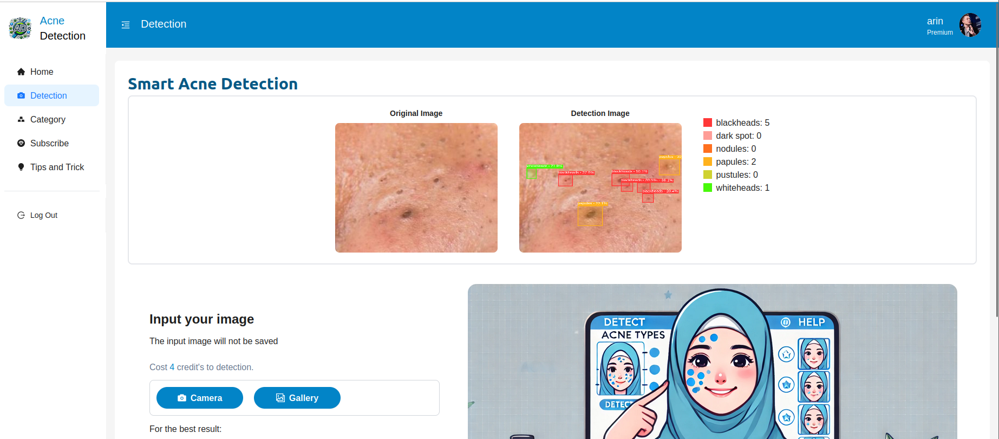

<a name="readme-top"></a>
<a name="readme-top"></a>

# [ Smart Acne Detection by IntelliGuardians](https://github.com/VickiAzwar/IntelliGuardians.git)
"Unlock the power of AI with Smart Detection – the ultimate acne detection app. Harness cutting-edge AI and ICP technology to quickly and efficiently assess your skin's condition."

<br />

<!-- TABLE OF CONTENTS -->
<details>
  <summary>Table of Contents</summary>
  <ul>
    <li><a href="#about-the-project">About The Project</a></li>
    <li><a href="#feature">Feature</a></li>
    <li><a href="#tech-stack">Tech Stack</a></li>
    <li><a href="#getting-started">Getting Started</a></li>
    <li><a href="#team">Team</a></li>
    <li><a href="#contact">Contact Information</a></li>
  </ul>
</details>

## Preview
[](https://example.com)


<p align="right">(<a href="#readme-top">back to top</a>)</p>

## About the Project
Smart Acne Detection is a smart acne detection application developed using React.js for the frontend and Kybra Python for the backend, with Internet Computer Protocol (ICP) based storage. This application allows users to detect six types of acne through analysis of captured images
from the camera or uploaded using AI technology. Smart Acne Detection can detect user acne and display data on detected acne. Users log in to the application using Internet Identity, adding another layer of security extra. For monetization, this application limits detection access to 5 times at the start. After that, users must subscribe to premium to continue using the service detect and access skin care tips. The combined use of AI and ICP makes this application fast, accurate and safe.

To learn more, see the available internet computer documents:
- [Quick Start](https://internetcomputer.org/docs/current/developer-docs/setup/deploy-locally)
- [SDK Developer Tools](https://internetcomputer.org/docs/current/developer-docs/setup/install)
- [Kybra Book](https://demergent-labs.github.io/kybra/the_kybra_book.html)

<p align="right">(<a href="#readme-top">back to top</a>)</p>


## Feature
 - Acne Type Detection: Detects and classifies six types of acne different.
 - Image Analysis: Using deep learning technology to detect from the camera or upload image.
 - Internet Identity: To access login with ICP.
 - Premium Subscription: Access detection without limitations.
 - Care Tips Menu: Tips for facial skin care.

<p align="right">(<a href="#readme-top">back to top</a>)</p>

## Tech Stack
- dfx 0.20.1
- Backend: kybra 0.6.0
- Frontend: Node Version 18 & vite
- AI: YoloV8
- Auth: Internet Identity

<p align="right">(<a href="#readme-top">back to top</a>)</p>


## Getting Started
To run this project in local, you can use the following commands:
1. Running dfx for create replica

```
# Starts the replica, running in the background
dfx start --background
```
2. Acivate enviroment
```
#activate environment has been installed package
source env/bin/activate
```
3. Deploy canister
```
# Deploys your canisters to the replica and generates your candid interface
dfx deploy
```
4. Insert data subcribes package
```
dfx canister call AcneDetection_backend insert_subscribe_packages
```
5. Install package frontend
```
npm install
```
6. Running frontend canister
```
nmp run start
```
<p align="right">(<a href="#readme-top">back to top</a>)</p>

## Team
1. Leader and Backend Developer : [Arin Cantika Musi](https://github.com/arincantikam26/)
2. Frontend Developer : [Puji Dhiya Nabila](https://github.com/Pujidhiyanabila)
3. AI Developer : [Vicki Azwar](https://github.com/VickiAzwar)

<p align="right">(<a href="#readme-top">back to top</a>)</p>

## Contact Information
If any questions occured, or in the need of any discussion or details, please contact use:
- email: arincantikam@gmail.com

<p align="right">(<a href="#readme-top">back to top</a>)</p>
